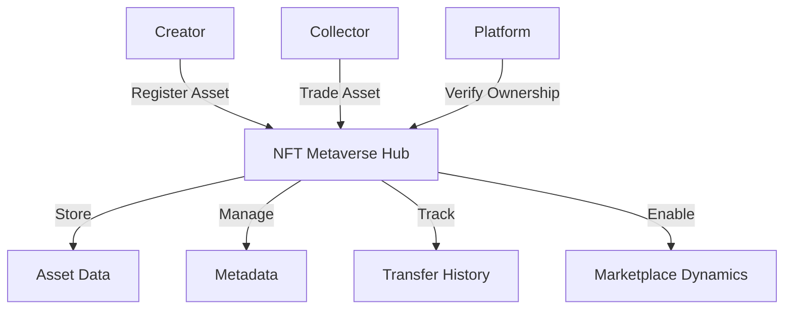

# Decentralized Devnet

A multi-platform digital asset management ecosystem built on blockchain technology.

## Overview

Decentralized Devnet provides a comprehensive, trustless infrastructure for managing and trading digital assets across virtual environments. It empowers creators, developers, and users with:

- Cross-platform asset tokenization (3D models, environments, digital artifacts)
- Secure asset trading with intelligent royalty mechanisms
- Immutable ownership and provenance tracking
- Flexible platform integration through standardized metadata
- Dynamic usage rights and transfer permissions

## Architecture

The system leverages a central hub contract that orchestrates asset registration, ownership management, and marketplace interactions.



### Core Components
- Asset Registry: Comprehensive asset data and ownership tracking
- Metadata Management: Rich, extensible asset information system
- Provenance Tracking: Immutable transfer history
- Marketplace Protocol: Secure, automated transaction infrastructure

## Contract Documentation

### NFT Metaverse Hub Contract

The central contract powering our cross-platform digital asset ecosystem.

#### Key Features
- Standardized asset registration with rich metadata
- Secure ownership transfer and historical tracking
- Intelligent marketplace with automated royalty distribution
- Universal ownership verification
- Dynamic metadata update capabilities

#### Access Control
- Granular asset modification permissions
- Automatic creator compensation
- Configurable transfer and usage policies

## Getting Started

### Prerequisites
- Clarinet
- Stacks wallet
- STX tokens for transactions

### Basic Usage

1. **Register a New Digital Asset**
```clarity
(contract-call? .nft-metaverse-hub register-asset
    "https://metadata.example.com/asset"
    "Cosmic Explorer Model"
    "Advanced 3D character for multiverse experiences"
    {x: u150, y: u200, z: u100}
    (list "Unity" "Unreal" "WebGL")
    "PG-13"
    "GLB"
    true
    u75)
```

2. **List Asset for Marketplace**
```clarity
(contract-call? .nft-metaverse-hub list-asset-for-sale asset-id price)
```

3. **Transfer Ownership**
```clarity
(contract-call? .nft-metaverse-hub transfer-asset asset-id recipient-address)
```

## Function Reference

### Public Functions

#### Asset Lifecycle
- `register-asset`: Create comprehensive digital asset registration
- `transfer-asset`: Securely transfer ownership
- `update-asset-metadata`: Modify asset characteristics
- `update-asset-settings`: Adjust transferability and royalty parameters

#### Marketplace Interactions
- `list-asset-for-sale`: Initiate marketplace listing
- `cancel-asset-listing`: Withdraw current listing
- `purchase-asset`: Execute asset acquisition

### Read-Only Functions
- `get-asset-info`: Retrieve core asset details
- `get-asset-metadata-by-id`: Access detailed asset information
- `get-asset-listing`: Inspect current marketplace status
- `get-asset-history`: Explore ownership provenance
- `verify-ownership`: Validate current possession

## Development

### Testing
1. Clone repository
2. Install Clarinet
3. Execute test suite:
```bash
clarinet test
```

### Local Interaction
1. Launch Clarinet console:
```bash
clarinet console
```
2. Interact with contracts:
```clarity
(contract-call? .nft-metaverse-hub ...)
```

## Security Considerations

### System Constraints
- Provenance tracking: 10 most recent transfers
- Royalty cap: 50% maximum
- Metadata length restrictions

### Recommended Practices
- Authenticate asset ownership pre-integration
- Validate transferability before transactions
- Verify metadata source authenticity
- Ensure precise royalty distribution
- Monitor transfer events systematically